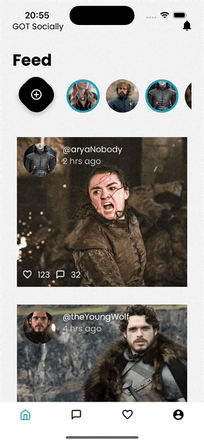

# SocialMedia

> This project consists of developing a layout for a social network application. In addition to having some implementations of technologies commonly used in the market.

## Demo

Add GIFs or screenshots here to show what your project looks like in action.




## Technologies Used

List the technologies and tools used in this project, for example:

- **ReactNative** - Frontend library
- **StyledComponents** - Style library
- **Axios** - Client library
- **react-native-mmkv** - Storage
- **react-query** - Requests
- **zustand** - state manager
- **Jest** - Testing library

## Project Structure

Outline the main folders and files in your project to guide contributors and users:

```plaintext
├── src/                    # Source files
├── App/                    # Static files
│   ├── App.tsx             
│   ├── assets/             # Images and icons
│   ├── data/               # API calls 
│   ├── domain/             # Business logic
│   └── infra/              # Library structure
│   └── jest/               
│   └── main/               # Adapters
│   └── presentation/       # Screens and components
│   └── types/              
├── .gitignore              # Files and folders to ignore in version control
├── package.json            # Project dependencies and scripts
└── README.md               # Project documentation


# Clone the repository
git clone hhttps://github.com/amandaduuaarte/SocialMediaApp.git

# Navigate to the project directory
cd SocialMediaApp

# Install dependencies
yarn

# Run the ios folder
cd ios
pod install

# run app
yarn ios
